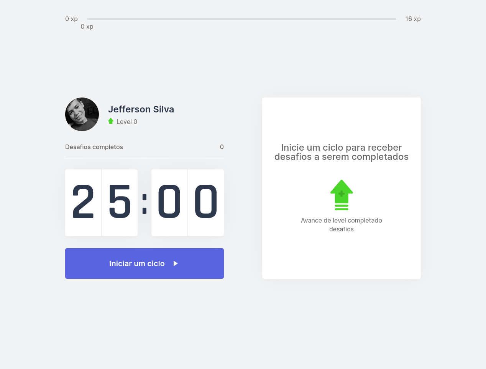

<h1 align="center">
    <a href="https://moveit-97zq65dkd-jeffsilva01.vercel.app/" >Move.it | #NLW4🔗</a>
</h1>
<p align="center"> Application developed at #NLW🚀 </p>

<p align="center">
 <a href="#technologies">Technologies</a> | 
 <a href="#usage">Usage</a> | 
 <a href="#author">Author</a> | 
 <a href="#license">License</a>
</p>

<h1 align="center">
 
</h1>

<h2 id="technologies"> 🛠 Technologies </h2>

The following tools were used in the construction of the project:

- [ReactJS](https://reactjs.org)
- [NextJS](https://nextjs.org)
- [Yarn](https://yarnpkg.com) or Npm
- [VSCode](https://code.visualstudio.com)

<h2 id="usage" > 👷 Usage </h2>

Required! Install git, node and yarn (or npm).

```bash
# Clone Repository
$ git clone https://github.com/JeffSilva01/Move.it.git

# Go to server folder
$ cd Move.it

# Install Dependencies
$ yarn

# Run Aplication
$ yarn dev

# Access localhost
http://localhost:3000
```

<h2 id="author"> 💻 Author </h2>


By Jefferson Silva ✌️ Find me:

[](https://www.linkedin.com/in/jeffsilva01/)

<h2 id="license"> 📝 License </h2>

This project is under the MIT license.
